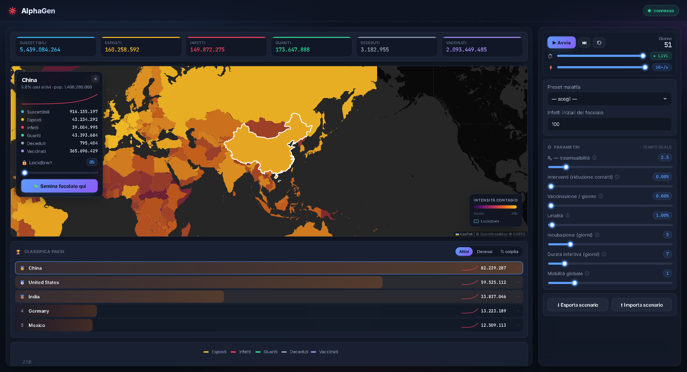

# 🦠 AlphaGen — Simulatore di diffusione epidemica

Piattaforma interattiva per simulare la diffusione mondiale di virus e malattie.
Il modello **SEIRD+V** in metapopolazione (una dinamica SEIR per ogni nazione)
gira sul backend e viene trasmesso in tempo reale all'interfaccia, dove è
possibile **modificare i parametri mentre la simulazione avanza** e osservarne
subito l'effetto su una **mappa mondiale** e su **grafici a curve**.




## Caratteristiche

- **Modello epidemiologico SEIRD+V** (Suscettibili, Esposti, Infetti, Guariti,
  Deceduti, Vaccinati) per 245 nazioni, con dati di popolazione reali.
- **Diffusione tra nazioni** tramite una rete voli reale (dataset OpenFlights)
  più una connettività di base che garantisce la raggiungibilità globale.
- **Controllo in tempo reale**: avvio/pausa, avanzamento manuale, velocità
  regolabile e modifica live di tutti i parametri tramite WebSocket.
- **Mappa mondiale** (Leaflet, tile scure): choropleth a intensità + **archi di
  volo animati** quando il contagio supera un confine.
- **Filtri di stato sulla mappa**: i chip dei totali mondiali sono cliccabili e
  scelgono **quali compartimenti** (S/E/I/R/D/V) compongono l'intensità mostrata
  sulla mappa (default: Esposti + Infetti); il tooltip del Paese riflette la metrica attiva.
- **Scheda paese**: click su una nazione → dettaglio SEIRD+V live, **sparkline**
  dei casi attivi, **lockdown per-paese** e pulsante "semina qui".
- **Grafici a curve** (ECharts) con aree sfumate per Esposti, Infetti, Guariti,
  Deceduti, Vaccinati.
- **Timeline / scrubber**: riavvolgi e rivedi l'evoluzione giorno per giorno
  (la mappa, le curve e la scheda mostrano il giorno selezionato).
- **Preset di malattie** reali pronti all'uso (18, da COVID-19 a Ebola),
  completamente modificabili.
- **Salva/Carica come file JSON** — esporta lo **stato completo** (l'intero
  buffer della timeline: curve del grafico, replay sulla mappa, parametri,
  compartimenti e lockdown per paese) e lo ripristina esattamente. Nessun DB.
- **Backup automatico incrementale** — ogni giorno simulato viene aggiunto a un
  log su disco (`backend/backups/`): se il server cade, al riavvio **riprende
  l'intera timeline** pre-crash e un client che si riconnette rivede tutto.
  Il backup è scaricabile da `GET /api/backup` nello stesso formato `SavedState`
  della funzione _Salva_, quindi è ricaricabile dall'interfaccia.

## Architettura

```
┌──────────────────────────┐         WebSocket /ws          ┌───────────────────────────┐
│        Frontend          │  ◀───── snapshot (stato) ─────  │          Backend          │
│      Angular 21          │  ─────▶ comandi (play/seed/…) ─ │       FastAPI + uv         │
│  (zoneless, signals)     │                                 │                            │
│                          │            REST /api            │  ┌──────────────────────┐  │
│  Leaflet  ·  ECharts     │  ◀─── presets/countries/geojson │  │  motore SEIRD+V       │  │
│                          │  ◀───▶ scenario (JSON)          │  │  (NumPy, metapop.)    │  │
└──────────────────────────┘                                 │  └──────────────────────┘  │
                                                              └───────────────────────────┘
```

Il backend mantiene un'unica simulazione condivisa, la fa avanzare (uno step =
un giorno) e trasmette uno _snapshot_ ad ogni passo ai client connessi. Il
client invia comandi e aggiorna l'interfaccia in modo reattivo tramite signal.

## Stack tecnologico

| Livello   | Tecnologia                                                |
| --------- | --------------------------------------------------------- |
| Backend   | Python 3.13, FastAPI, Uvicorn, NumPy, gestione con **uv** |
| Real-time | WebSocket                                                 |
| Frontend  | Angular 21 (standalone, zoneless, signal-based)           |
| Mappa     | Leaflet                                                   |
| Grafici   | Apache ECharts                                            |

## Prerequisiti

- [**uv**](https://docs.astral.sh/uv/) (gestisce automaticamente Python 3.13)
- **Node.js** 20+ e **npm**

## Avvio rapido

Servono due terminali.

### 1) Backend — porta 8000

```bash
cd backend
uv run uvicorn app.main:app --reload --port 8000
```

`uv` crea l'ambiente virtuale e installa le dipendenze al primo avvio. I dataset
necessari (`countries.json`, `world.geo.json`) sono già inclusi nel repository.

### 2) Frontend — porta 4200

```bash
cd frontend
npm install
npm start
```

Apri **http://localhost:4200**, scegli un preset, **clicca un paese** sulla mappa
per aprire la sua scheda e premi **🦠 Semina focolaio qui**, poi **▶ Avvia** e
regola gli slider mentre la simulazione procede. Dalla scheda puoi anche imporre
un **lockdown** al singolo paese; con la **timeline** riavvolgi e rivedi l'epidemia.

## Il modello di simulazione

Per ogni nazione _i_ si evolvono i compartimenti S, E, I, R, D, V con un
aggiornamento giornaliero (Eulero esplicito, `dt = 1 giorno`):

```
β_eff   = (R₀ / durata_infettiva) · (1 − interventi)
apert_i = 1 − lockdown_i
σ       = 1 / incubazione
γ       = 1 / durata_infettiva

prev_i  = apert_i · I_i / N_i
λ_i     = β_eff · prev_i  +  mobilità · apert_i · Σ_j W[i,j] · prev_j
nuovi_E = λ_i · S_i
nuovi_I = σ · E_i
uscita  = γ · I_i
nuovi_D = letalità · uscita
nuovi_R = (1 − letalità) · uscita
nuovi_V = vaccinazione · S_i
```

dove `W[i,j]` è il peso di viaggio (rete voli) dalla nazione _j_ alla _i_ (il
termine con `W` è la pressione infettiva importata dall'estero) e `lockdown_i`
è l'intervento **per singolo paese**, che riduce sia la trasmissione locale sia
import ed export di quel paese. Ogni transizione è limitata alla popolazione
disponibile nel compartimento di partenza (il modello conserva la popolazione).

## Parametri interattivi

Tutti i parametri sono modificabili **durante** la simulazione.

| Parametro                 | Effetto                                                     |
| ------------------------- | ----------------------------------------------------------- |
| **R₀**                    | Trasmissibilità di base (β = R₀ / durata infettiva)         |
| **Interventi**            | Riduzione dei contatti (lockdown/distanziamento): abbassa β |
| **Vaccinazione / giorno** | Frazione di suscettibili vaccinati ogni giorno              |
| **Letalità**              | Frazione di infetti che decede invece di guarire            |
| **Incubazione**           | Durata della fase Esposto (E → I), in giorni                |
| **Durata infettiva**      | Durata della fase Infetto (I → R/D), in giorni              |
| **Mobilità globale**      | Moltiplicatore sullo scambio tra nazioni                    |

## API

Base URL: `http://localhost:8000`

### REST

| Metodo | Path                  | Descrizione                                      |
| ------ | --------------------- | ------------------------------------------------ |
| `GET`  | `/api/health`         | Healthcheck                                      |
| `GET`  | `/api/config`         | Configurazione unica (default/bound/limiti)      |
| `GET`  | `/api/countries`      | Metadati nazioni (ISO, popolazione, coordinate)  |
| `GET`  | `/api/geojson`        | Confini del mondo (GeoJSON) per la mappa         |
| `GET`  | `/api/flights`        | Rete voli (coppie di paesi) per gli archi        |
| `GET`  | `/api/presets`        | Preset di malattie                               |
| `GET`  | `/api/scenario?name=` | Stato live di un singolo frame (uso interno)     |
| `POST` | `/api/scenario`       | Sincronizza il motore a uno stato (no broadcast) |
| `GET`  | `/api/backup`         | Backup di crash come `SavedState` scaricabile    |

### WebSocket `/ws`

**Client → server** (comandi):

```jsonc
{ "type": "play" }
{ "type": "pause" }
{ "type": "reset" }
{ "type": "step" }
{ "type": "seed", "iso": "USA", "count": 100 }
{ "type": "setParams", "params": { } }
{ "type": "setSpeed", "speed": 10 }
{ "type": "setCountryIntervention", "iso": "ITA", "value": 0.6 }
{ "type": "getHistory" }
```

**Server → client** (ad ogni step):

```jsonc
{
	"type": "snapshot",
	"day": 42,
	"running": true,
	"speed": 10,
	"params": {},
	"totals": { "s": 0, "e": 0, "i": 0, "r": 0, "d": 0, "v": 0 },
	"countries": [
		{
			"iso": "ITA",
			"name": "Italy",
			"population": 0,
			"s": 0,
			"e": 0,
			"i": 0,
			"r": 0,
			"d": 0,
			"v": 0,
			"intervention": 0,
		},
	],
}
```

In risposta a **`getHistory`** (che il client invia all'apertura) il server
restituisce sia la serie storica dei totali per giorno (`points`, per il
grafico), sia la **timeline completa** in forma colonnare compatta (`frames`:
metadati dei Paesi una sola volta + i compartimenti per giorno). Così un client
che si collega a simulazione già avviata ricostruisce l'intero grafico **e** può
scorrere la timeline fino al giorno 0 (lo stato è condiviso e persistente):

```jsonc
{
	"type": "history",
	"points": [
		{
			"day": 0,
			"totals": { "s": 0, "e": 0, "i": 0, "r": 0, "d": 0, "v": 0 },
		},
	],
	"frames": {
		"iso": ["USA", "..."],
		"name": ["United States", "..."],
		"population": [0, 0],
		"frame": [
			{
				"day": 0,
				"speed": 5,
				"params": {},
				"s": [0],
				"e": [0],
				"i": [0],
				"r": [0],
				"d": [0],
				"v": [0],
				"c": [0],
			},
		],
	},
}
```

## Configurazione

Tutti i valori di dominio e comportamento (default e bound dei parametri, limiti,
versione del formato di salvataggio, velocità, dimensione del focolaio, default
della mappa, porta e origini CORS) vivono in **un'unica sorgente**:
`backend/app/config.json` (vedi `backend/app/config.py`). Non sono mai
hardcoded nei singoli moduli: il modello Pydantic ne deriva default e bound, il
motore ne legge limiti e clamp, e il frontend li scarica a runtime da
`GET /api/config` per costruire slider, validazione e default — così nessun
valore è duplicato tra backend e frontend.

- **Parametri / limiti / versione / speed / seed / CORS**: modificali in
  `backend/app/config.json`; si propagano automaticamente a backend e frontend.
- **Connessione del client** (non derivabile dal backend stesso): gli URL/porta a
  cui il frontend si collega sono in `frontend/src/app/config.ts`
  (`API_BASE` / `WS_URL`); la porta del backend e le origini CORS in
  `config.json` (`server.port`, `server.corsOrigins`). Per un deploy non-dev,
  aggiorna entrambi.

## Dati

Tutti i dataset sono già inclusi e versionati in `backend/app/data/`:
`countries.json` (popolazione e coordinate), `world.geo.json` (confini per la
mappa), `flights.json` (rete voli tra nazioni) e `presets.json` (malattie).

### Backup automatico e ripristino

Lo stato vive in memoria (nessun DB), ma per non perdere una simulazione in caso
di crash il backend scrive un **log incrementale** in `backend/backups/backup.ndjson`
(ignorato da Git): una riga di intestazione con i metadati dei Paesi, poi **una riga
per ogni giorno** simulato (append-only, costo costante). Al riavvio il server legge
il log e **ripristina l'intera timeline** pre-crash via `restore`, così chi si
riconnette rivede grafico e scrubber completi. Lo stesso log è ricostruibile nei due
formati importabili standard: `SavedState` (scaricabile da `GET /api/backup`,
caricabile dall'interfaccia) e `Scenario` (l'ultimo giorno, per `POST /api/scenario`).
La ricostruzione è _last-writer-wins_ per giorno ed è limitata agli ultimi
`DATA_LIMIT` giorni, coerente con la retention dell'app.

### Ordine e copertura dei Paesi

I 245 Paesi del modello sono ordinati per popolazione decrescente: **questo
ordine è l'indice degli array del modello**. La mappa colora un Paese facendo
corrispondere l'`id` ISO‑3 della feature GeoJSON al codice del Paese; **235/245**
Paesi hanno un confine. I 10 mancanti (dipartimenti francesi d'oltremare, fusi
nella Francia dal dataset, e poche isolette) non vengono colorati ma sono
comunque simulati grazie al coupling di base (`baseline_epsilon`).

## Fonti dei dati

- Popolazione e coordinate delle nazioni: [REST Countries](https://restcountries.com/).
- Confini delle nazioni (GeoJSON): [Natural Earth 1:10m Admin 0 – Countries](https://www.naturalearthdata.com/)
  ([`nvkelso/natural-earth-vector`](https://github.com/nvkelso/natural-earth-vector)).
  Ogni feature ha l'`id` rimappato all'ISO‑3, le proprietà
  ridotte al solo `name` e le geometrie semplificate (Douglas‑Peucker + arrotondamento) per contenere il peso mantenendo i micro‑Stati.
- Rete voli tra nazioni: [OpenFlights](https://openflights.org/data.html). Il
  peso di ogni coppia di paesi è il numero di rotte aeree tra essi (normalizzato),
  usato come proxy reale di connettività; la mappatura ISO usa REST Countries.

## Test

### Backend (pytest)

```bash
cd backend
uv run pytest
uv run pytest -m unit
uv run pytest -m integration
```

### Frontend (Playwright)

```bash
cd frontend
npx playwright install chromium
npm run e2e
```

## Licenza

Distribuito con licenza **MIT**. Vedi il file [`LICENSE`](LICENSE).
